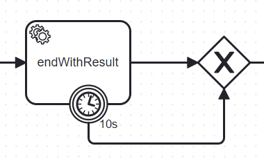

[](https://github.com/Camunda-Community-Hub/community/blob/main/extension-lifecycle.md#stable-)
[](https://github.com/camunda-community-hub/community)


# C8-execute-with-result


# Principle

in Camunda 7, it is possible to create a process instance and to execute multiple tasks synchrously, before returning the result to the API.

Let's start with a process like this.


Via the API, when a call to "StartTheGame" is performed, you need that API call to block the thread until a certain point, like after the `log` 
service task.

This behavior is possible in Camunda 7, using the "transaction" functionality.

In Camunda 8, the API sends the command and gives back the control. Zeebe executes it asynchronously.


Imagine you want to block the thread during this execution, waiting until the process reaches a certain point.
For example, the process calls a service to book a concert ticket, and you want to give the API the reservation result.
The thread must be blocked while waiting for this point, and then the process variable (reservation number) must be collected.


This is the role of this library.

There are three use cases, to block the thread and wait for a certain point in the process :
* at the creation of the process instance
* After a user task
* after publishing a message

Note: for the first usage, an API "createWithResult" exists with two limitations:
* It waits until the end of the process, only when the process reaches a milestone
* If the execution is over the duration of the timeout, it returns an exception.
* In that Exception, the process instance created is not returned. If you want to cancel the process instance because it's too long, it is impossible.
  The application knows a process instance is created but doesn't need to know which one.

This library does not cover some use cases, especially the parallel process. See the Limitation section.


# API


The API is

```
  /**
     * processInstanceWithResult
     *
     * @param processId       processId to start
     * @param variables       Variables to update the task at completion
     * @param timeoutDuration maximum duration time, after the ExceptionWithResult.timeOut is true
     * @return the result status
     * @throws Exception in case of error
     */
    public CompletableFuture<ExecuteWithResult> processInstanceWithResult(String processId,
                                                                          Map<String, Object> variables,
                                                                          String prefixTopicWorker,
                                                                          Duration timeoutDuration) throws Exception {

}

  /**
     * executeTaskWithResult
     *
     * @param userTask        user task to execute
     * @param assignUser      the user wasn't assign to the user task, so do it
     * @param userName        userName to execute the user task
     * @param variables       Variables to update the task at completion
     * @param timeoutDuration maximum duration time, after the ExceptionWithResult.timeOut is true
     * @return the result variable
     * @throws Exception for any error
     */
    public CompletableFuture<ExecuteWithResult> executeTaskWithResult(Task userTask,
                                                                      boolean assignUser,
                                                                      String userName,
                                                                      Map<String, Object> variables,
                                                                      String prefixTopicWorker,
                                                                      Duration timeoutDuration) throws Exception {
 
 }  
    /**
     * Publish message and wait until the worker handle the point
     *
     * @param messageName message name
     * @param correlationKey key to send to the corelation
     * @param timeToLive Duration to live the message
     * @param variables variables to send to the message
     * @param prefixTopicWorker prefix to use for the worker
     * @param timeoutDuration duration, after this delay, the API will be unlocked
     * @return a Future
     * @throws Exception
     */
    public CompletableFuture<ExecuteWithResult> publishNewMessageWithResult(String messageName,
                                                                            String correlationKey,
                                                                            Duration timeToLive,
                                                                            Map<String, Object> variables,
                                                                            String prefixTopicWorker,
                                                                            Duration timeoutDuration) throws Exception {
  }
```

# How to instrument the process

A marker must be placed when the result should return. The process is then initiated with a service task (or a listener in 8.6 or later).

## Register a worker (or a listener)

It must register the type. 

```feel
topicEndResult
```
The library will create a process variable `topicEndResult`. The FEEL expression will search for a specific worker.


## Worker or Listener?
Branching the worker in a service task or as a listener in any task is possible.

### In a worker
The execution's border is visible: this is the service task. With a listener, this border is not visible.
The service task handles a use case: if the application stops. The implementation is based on a dynamic worker. Only one worker has started to capture this execution.

For the limitation "application is stopped", it is possible to add a Timer Boundary event on the service task to unlock the execution after a delay, like 10 seconds.

### in a listener
The mechanism is not visible in the BPMN and does not bother the Business modeler.

However, the "Application is stopped" issue becomes a real one because there is no mechanism to bypass a START listener.
A START listener has to be executed. A END listener can be interrupted by a timer.


# Difference between this library and ZeebeAPIWithResult

The ZeebeAPI provide a API `createProcessInstanceWithResult` : https://docs.camunda.io/docs/apis-tools/zeebe-api/gateway-service/#createprocessinstancewithresult-rpc

The difference between the `ZeebeAPIWithResult` and this library is:

* `ZeebeAPIWithResult` waits for the end of the process instance. It is not possible to block the thread until it reaches a special point. ZeebeAPIWithResult wait until the end of the process instance. This library can be placed in the process and will trigger when the process instance reaches the marker, not at the end of the process instance
* If the timeout fires, `ZeebeAPIWitResult` will return an exception, and the caller does not know the process instance created. If the use case is to cancel the process instance when it takes too much time, this is not possible with `ZeebeAPIWithResult`. This API will send back the process instance created.
* the API implements the `CompletableFuture`. It's possible to implement the caller in a ReactiveProgramming way.
* `ZeebeAPIWithResult` does not implement the synchronous call on user execution or on message execution.
* 

# User task with a result 


A user task is present in the process, and the application wants to call an API that will wait 
until the process instance passes the task "log".

The call is
```
      ExecuteWithResult executeWithResult = taskWithResult.executeTaskWithResult(task, true,
                "demo",
                Map.of("Cake", "Cherry"),
                "UserTaskWithResult",
                Duration.ofMinutes(2))
                .join();

```
Not the `join()` call. This is part of the `CompletableFuture` interface.

The API will wait 2 minutes before gives up. If the execution is done before 2 minutes,
the thread will be unblocked and the result is known. 

If after 2 minutes the execution does not reach the marker, then the thread is unlocked but then 
`executeWithResult.timeOut` egal to true.
 


# Create a process instance with the result

To create a process instance and wait for the marker, use this API

```
  ExecuteWithResult executeWithResult = taskWithResult.processInstanceWithResult( processId,
                                                                          myVariables,
                                                                          jobKey,
                                                                          "a-prefix",
                                                                          Duration.ofMinutes(2))
                                                                          .join();
  if (executeWithResult.timeOut) {
    logger.info("Not reach the marker in 2 minutes, the process instance is {}",executeWithResult.processInstance);
  }
```


# Limitations

## Application is blocked

If the application is stopped, the unique worker is stopped, too.
And because it is based on a "random" number (the number is the job key or the process instance), the application, when it will be restarted, workers will not be created.
Then, the process instance is stuck forever in the worker.

To avoid that, a timer must be placed on the service task


## Parallel path

Let's take this process


The boundary of the execution is all the tasks. To be sure that all tasks are executed, you want to wait until Q2, A3, and A4 are executed.
Multiple markers must be placed, one for each path, and then the notification must be executed only when the three markers are reached.

This is possible, but the number 3 must be hardcoded in the library or passed in as a process variable, which is not very fair.
It becomes impossible when the parallel gateway is an inclusive gateway parallel to the condition. A process instance may follow one, two, or three paths. How do you unlock it?

This library does not resolve this issue.

# Run the test


Upload the process `ExecuteUserTaskWithResult.bpmn` and `ExecuteUserTaskWithResultLinetener.bpmn`

Start the application `src/main/java/io/camunda/executewithresult/ExecuteApplication.java`.

This application runs the `src/main/java/io/camunda/executewithresult/scenario/ScenarioUserTask.java`

This application will connect to a Zeebe Server.
(check the `src/main/resources/application.yaml` to describe the connection) and every 30 seconds, it will create a process instance in the process

```
public static final String PROCESS_ID = "executeUserTaskWithResultListener";
```
Note: there are two examples, so change the PROCESS_ID to run one or another method

Using the toggle modeExecution, you can switch to `single` or `multiple`.
The single starts only 1 process instance every 30 seconds, while the multiple starts 10 process instances.


# How it's work
In Zeebe, the call is asynchronous. So when the Zeebe API `completeTask` is called, the thread is free and can continue the execution.

So, the idea is to create an lockObjectTransport object, registered it on a unique key, and on the worker at the end, retrieve the object and "complete" the CompletableFuture


This object was created just before and saved in a map. The Key is the jobKey, which is unique.
```
 LockObjectTransporter lockObjectTransporter = new LockObjectTransporter();
    lockObjectTransporter.jobKey = jobKey;
    synchronized (lockObjectsMap) {
      lockObjectsMap.put(jobKey, lockObjectTransporter);
    }

```

The object is notified in the worker:
```
       public void handle(JobClient jobClient, ActivatedJob activatedJob) throws Exception {
            // Get the variable "lockKey"
            jobClient.newCompleteCommand(activatedJob.getKey()).send();

            String jobKey = (String) activatedJob.getVariable(WithResultAPI.PROCESS_VARIABLE_JOB_KEY);
            // logger.info("Handle marker for jobKey[{}]", jobKey);
            ResultWorkerDynamic.LockObjectTransporter lockObjectTransporter = lockObjectsMap.get(jobKey);

            if (lockObjectTransporter == null) {
                logger.error("No object for jobKey[{}]", jobKey);
                return;
            }
            lockObjectTransporter.processVariables = activatedJob.getVariablesAsMap();
            lockObjectTransporter.elementId = activatedJob.getElementId();
            lockObjectTransporter.elementInstanceKey = activatedJob.getElementInstanceKey();
            logger.debug("HandleMarkerDynamicWorker jobKey[{}] variables[{}]", jobKey, lockObjectTransporter.processVariables);

            // notify withResult that we got the answer
            switch(lockObjectTransporter.caller) {
                case PROCESSINSTANCE -> withResultAPI.completeLaterProcessInstanceWithResult(lockObjectTransporter);
                case USERTASK -> withResultAPI.completeLaterExecuteTaskWithResult(lockObjectTransporter);
                case MESSAGE -> withResultAPI.completeLaterPublishMessageWithResult(lockObjectTransporter);
            }

        }
```

When activated, the worker must retrieve the waiting object in the Map. The `jobKey` must be passed as a process variable.

We need to activate the handler call specifically to be sure this is on the same Java machine. This method can be implemented in an application deployed in a replica.
To ensure that the worker is dynamic, the topic contains the job Key and the method for registering the new worker.


On the Dynamic implementation, for each request, a worker is created
```
        LockObjectTransporter lockObjectTransporter = new LockObjectTransporter();
        lockObjectTransporter.jobKey = jobKey;
        lockObjectTransporter.context = context;
        lockObjectTransporter.caller = caller;

        logger.debug("Register worker[{}]", getTopic(context, prefixTopicWorker, jobKey));

        lockObjectTransporter.worker = zeebeClient.newWorker()
                .jobType(getTopic(context, prefixTopicWorker, jobKey))
                .handler(handleMarkerDynamicWorker)
                .streamEnabled(true)
                .open();

        synchronized (lockObjectsMap) {
            lockObjectsMap.put(jobKey, lockObjectTransporter);
        }

        return lockObjectTransporter;
```

in the Host implementation, the worker is created per host

```
       LockObjectTransporter lockObjectTransporter = new LockObjectTransporter();
        lockObjectTransporter.jobKey = jobKey;
        lockObjectTransporter.context = context;
        lockObjectTransporter.caller = caller;

        logger.debug("Register worker[{}] jobKey[{}]", getTopic(context, prefixTopicWorker, jobKey), jobKey);

        JobWorker worker = getWorker(getTopic(context, prefixTopicWorker, jobKey));

        synchronized (lockObjectsMap) {
            lockObjectsMap.put(jobKey, lockObjectTransporter);
        }

        return lockObjectTransporter;
```

and the getWorker is
```` 
    static final Map<String, LockObjectTransporter> lockObjectsMap = new ConcurrentHashMap<>();
    static final ConcurrentHashMap<String, JobWorker> mapWorker = new ConcurrentHashMap<>();
    final ZeebeClient zeebeClient;
    final HandlerEndResult handleMarker;
    final String podName;
    Logger logger = LoggerFactory.getLogger(ResultWorkerHost.class.getName());

    ResultWorkerHost(ZeebeClient zeebeClient, String podName, WithResultAPI withResultAPI) {
        this.zeebeClient = zeebeClient;
        this.podName = podName;
        this.handleMarker = new HandlerEndResult(withResultAPI);
    }


    /**
     * Open the transaction. Worker may be created the first time, then reuse. It return a lockObjectTransporter, and the caller can modify it.
     * The caller will execute the command (create a process instance, execute the user task, publish the message). The caller must pass the jobKey
     * as a process variable WithResultAPI.PROCESS_VARIABLE_JOB_KEY. The handler retrieve the key, then the object, and will call the callback according
     * the caller.
     *
     * @param context           information
     * @param prefixTopicWorker prefix of the worker, to calculate the topic for the dynamic worker
     * @param jobKey            key for the handler to retrieve the correct lockObjetTransporter
     * @param caller            who call the transaction, to have the callback method
     * @return
     */
    @Override
    public LockObjectTransporter openTransaction(String context, String prefixTopicWorker, String jobKey, LockObjectTransporter.CALLER caller) {
        LockObjectTransporter lockObjectTransporter = new LockObjectTransporter();
        lockObjectTransporter.jobKey = jobKey;
        lockObjectTransporter.context = context;
        lockObjectTransporter.caller = caller;

        logger.debug("Register worker[{}] jobKey[{}]", getTopic(context, prefixTopicWorker, jobKey), jobKey);

        JobWorker worker = getWorker(getTopic(context, prefixTopicWorker, jobKey));

        synchronized (lockObjectsMap) {
            lockObjectsMap.put(jobKey, lockObjectTransporter);
        }

        return lockObjectTransporter;
    }

    /**
     * The topic is different per host
     *
     * @param context
     * @param prefixTopicWorker
     * @param jobKey
     * @return
     */
    @Override
    public String getTopic(String context, String prefixTopicWorker, String jobKey) {
        return prefixTopicWorker + podName;
    }


    @Override
    public void closeTransaction(LockObjectTransporter lockObjectTransporter) {
        // we got the result
        // we can close the worker now
        synchronized (lockObjectsMap) {
            lockObjectsMap.remove(lockObjectTransporter.jobKey);
        }
    }


    private JobWorker getWorker(String topicName) {
        JobWorker worker = mapWorker.get(topicName);
        if (worker == null) {
            synchronized (this) {
                if (mapWorker.get(topicName) == null) {
                    worker = zeebeClient.newWorker()
                            .jobType(topicName)
                            .handler(handleMarker)
                            .streamEnabled(true)
                            .open();
                    mapWorker.put(topicName, worker);
                }
            }
        }
        return worker;
    }

````

This is why the topic contains the jobKey. So, the same Java machine will run the worker.

# What's news in 2.0?
This implementation reaches a next level in terms of performance. Executing 1 service task, and wait for the result can be done now in 24 ms, 3000 PI/s on a 30 clauster size.

The implementation offer now:
* CreateProcessInstanceWithResult
* publishNewMessageWithResult

Two implementations on the worker are available:
* Dynamic (old one) create one worker per request.
* Host: create one worker per host, which is faster because the worker is created at begining, and its never stops. This offer an higher throughput and reduce the backpressure on the server.

Signature change: now all API offer a CompletableFuture object, which allow to implement a Reactive programing option.
