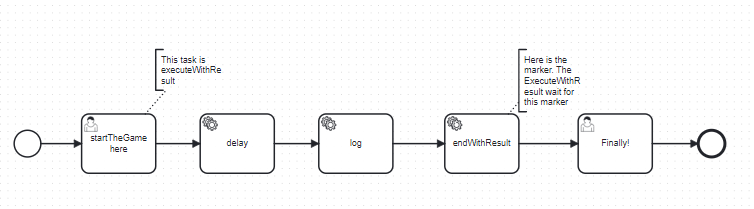
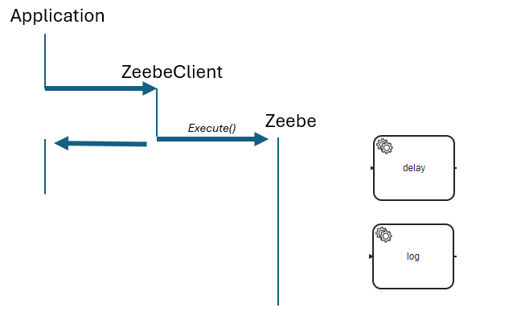
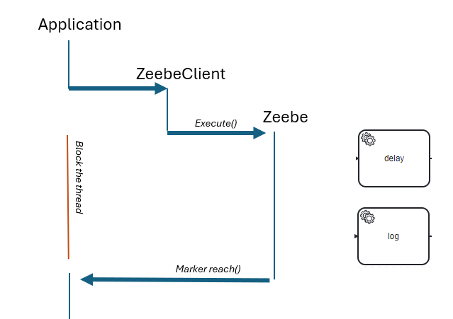
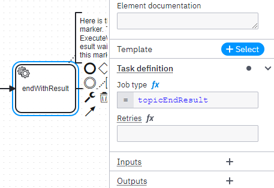
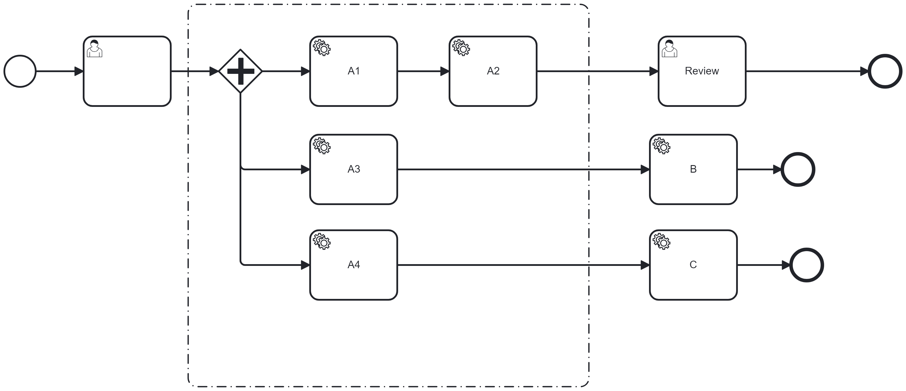

[](https://github.com/Camunda-Community-Hub/community/blob/main/extension-lifecycle.md#stable-)
[](https://github.com/camunda-community-hub/community)


# C8-execute-usertask-with-result

# Principle

Let's start with a process like this.




Via the API, when a call to "StartTheGame" is performed, you need that API call to block the thread until a certain point, like after the `log` service task.

This behavior is possible in Camunda 7, using the "transaction" functionality.

In Camunda 8, the API sends the command and gives back the control. Zeebe executes it asynchronously.



Imagine you want to block the thread during this execution, waiting until the process reaches a certain point.
For example, the process calls a service to book a concert ticket, and you want to give the API the reservation result.
The thread must be blocked while waiting for this point, and then the process variable (reservation number) must be collected.



This is the role of this library.
There are two use cases:
* After a user task, block the thread and wait for a certain point in the process
* Block the thread and wait for a certain point after the process is created.

Note: for the second user, an API "createWithResult" exists with two limitations:
* It waits until the end of the process, only when the process reaches a milestone
* If the execution is over the duration of the timeout, it returns an exception.
* In that Exception, the process instance created is not returned. If you want to cancel the process instance because it's too long, it is impossible.
  The application knows a process instance is created but doesn't need to know which one.

Implementing this library covers some use cases, especially the parallel process. See the Limitation section.


# User Task With Result
A user task is present in the process, and the application wants to call an API that will wait until the process instance passes the task "log."


The API is

```java
 /**
   * executeTaskWithResult
   *
   * @param userTask            user task to execute
   * @param assignUser          the user wasn't assigned to the user task, so do it
   * @param userName            userName to execute the user task
   * @param variables           Variables to update the task at completion
   * @param timeoutDurationInMs maximum duration time, after the ExceptionWithResult.timeOut is true
   * @return the process variable
   * @throws Exception
   */
  public ExecuteWithResult executeTaskWithResult(Task userTask,
                                                 boolean assignUser,
                                                 String userName,
                                                 Map<String, Object> variables,
                                                 long timeoutDurationInMs) throws Exception

```

For example, it can be called via
```java
TaskWithResult.ExecuteWithResult executeWithResult = taskWithResult.executeTaskWithResult(userTask,
      true,
      "demo",
      userVariable, 
      10000L);
```


## How to instrument the process

A marker must be placed when the result should return. The process is then initiated with a service task (or a listener in 8.6 or later).
It must register the type
```feel
"end-result-"+jobKey
```



## How it's work
In Zeebe, the call is asynchronous. So when the Zeebe API `completeTask` is called, the thread is free and can continue the execution.

So, the idea is to block it on an object
```java
   // Now, we block the thread and wait for a result
    lockObjectTransporter.waitForResult(timeoutDurationInMs);
```

This object was created just before and saved in a map. The Key is the jobKey, which is unique.
```java
 LockObjectTransporter lockObjectTransporter = new LockObjectTransporter();
    lockObjectTransporter.jobKey = jobKey;
    synchronized (lockObjectsMap) {
      lockObjectsMap.put(jobKey, lockObjectTransporter);
    }

```

The object is notified in the worker:
```java
  private class HandleMarker implements JobHandler {
    public void handle(JobClient jobClient, ActivatedJob activatedJob) throws Exception {
      // Get the variable "lockKey"
      String jobKey = (String) activatedJob.getVariable("jobKey");
      logger.info("Handle marker for jobKey[{}]", jobKey);
      LockObjectTransporter lockObjectTransporter = lockObjectsMap.get(jobKey);

      if (lockObjectTransporter == null) {
        logger.error("No object for jobKey[{}]", jobKey);
        return;
      }
      lockObjectTransporter.processVariables = activatedJob.getVariablesAsMap();
      logger.debug("HandleMarker jobKey[{}] variables[{}]", jobKey, lockObjectTransporter.processVariables);

      // Notify the thread waiting on this item
      lockObjectTransporter.notifyResult();
    }
```

When activated, the worker must retrieve the waiting object in the Map. The `jobKey` must be passed as a process variable.

We need to activate the handler call specifically to be sure this is on the same Java machine. This method can be implemented in an application deployed in a replica.
To ensure that the worker is dynamic, the topic contains the job Key and the method for registering the new worker.

```java
   JobWorker worker = zeebeClient.newWorker()
        .jobType("end-result-" + jobKey)
        .handler(handleMarker)
        .streamEnabled(true)
        .open();
```
This is why the topic contains the jobKey. So, the same Java machine will run the worker.

The second advantage is in execution time. Instead of having one worker running handle all the management, there is now one worker per execution.
The worker will be notified faster in this way when the process instance reaches the task.


# Create a process instance with the result

The same behavior can be implemented for the Create process instance.
The advantages between the ZeebeAPI withResult are:
* ZeebeAPI withResult waits for the end of the process instance. This mechanism can be placed in the process and will trigger when the process instance reaches the marker, not at the end of the process instance
* If the timeout fires, ZeebeAPI will return an exception without creating the process instance. If the use case is to cancel the process instance because it takes too much time, this is not possible. This API will send back the process instance created.

Note: this implementation is not done at this moment

# Worker or Listener?
Branching the worker in a service task or as a listener in any task is possible.

## In a worker
The execution's border is visible: this is the service task. With a listener, this border is not visible.
The service task handles a use case: if the application stops. The implementation is based on a dynamic worker. Only one worker has started to capture this execution.

For the limitation "application is stopped", it is possible to add a Timer Boundary event on the service task to unlock the execution after a delay, like 10 seconds.

## in a listener
The mechanism is not visible in the BPMN and does not bother the Business modeler.

However, the "Application is stopped" issue becomes a real one because there is no mechanism to bypass a listener. It has to be executed, and it's not possible to add a timer. If the application is stopped when some process instances are captured, only a general timer event or a timer on the task (which will cancel the task, too) is possible.

# Limitations

## Application is stopped

If the application is stopped, the unique worker is stopped, too.
And because it is based on a "random" number (the number is the job key or the process instance), the application, when it will be restarted, workers will not be created.
Then, the process instance is stuck forever in the worker.

## Parallel path

Let's take this process


The boundary of the execution is all the Ax tasks. To be sure that all tasks are executed, you want to wait until Q2, A3, and A4 are executed.
Multiple markers must be placed, one for each path, and then the notification must be executed only when the free markers are reached.

This is possible, but the number 3 must be hardcoded in the library or passed in as a process variable, which is not very fair.
It becomes impossible when the parallel gateway is an inclusive gateway parallel to the condition. A process instance may follow one, two, or three paths. How do you unlock it?

This library does not resolve this issue.

# Run the test


Upload the process `ExecuteUserTaskWithResult.bpmn` and `ExecuteUserTaskWithResultLinetener.bpmn`

Start the application `src/main/java/io/camunda/executewithresult/ExecuteApplication.java`.

This application runs the `src/main/java/io/camunda/executewithresult/scenario/ScenarioUserTask.java`

This application will connect to a Zeebe Server.
(check the `src/main/resources/application.yaml` to describe the connection) and every 30 seconds, it will create a process instance in the process

```java
public static final String PROCESS_ID = "executeUserTaskWithResultListener";
```
Note: there are two examples, so change the PROCESS_ID to run one or another method

Using the toggle modeExecution, you can switch to `single` or `multiple`.
The single starts only 1 process instance every 30 seconds, while the multiple starts 10 process instances.
